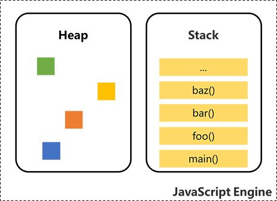
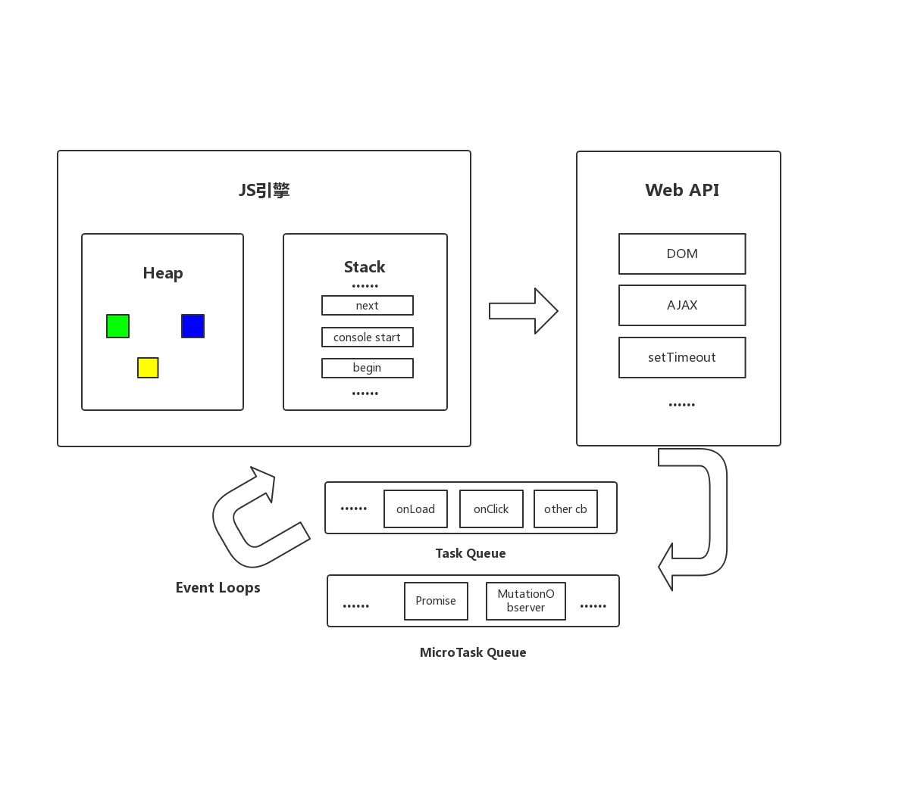
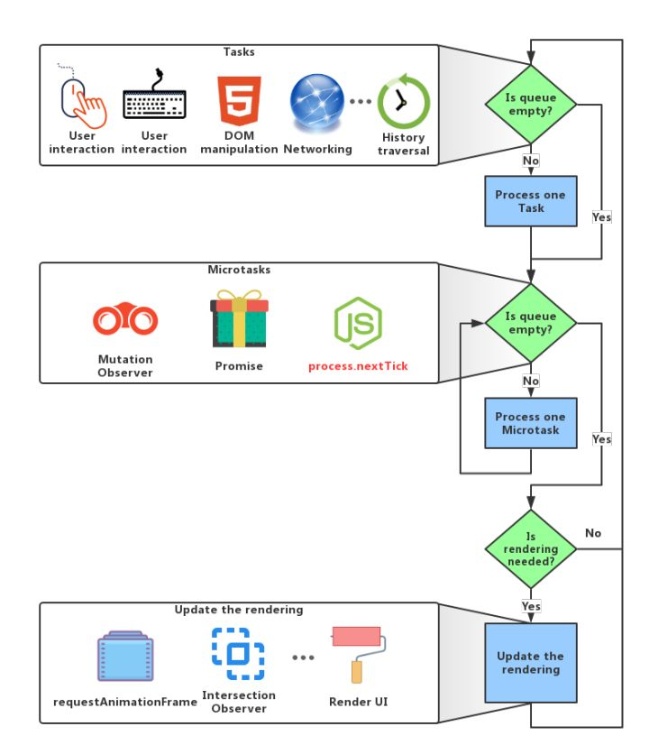
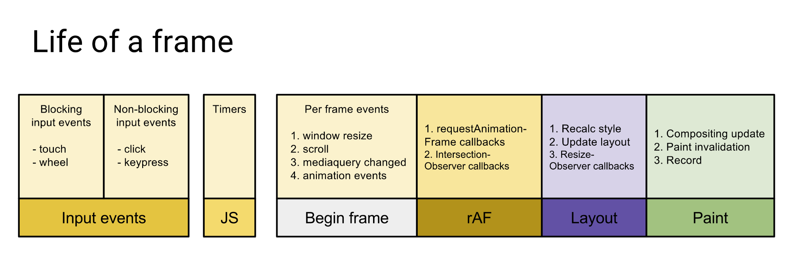

JavaScript event loop and async
===============================

先抛出核心要点：

  * `Event Loops` 模型是辅助 **单线程** 的JS引擎 **非阻塞** 执行任务，实现异步的根本

  * `Event Loops` 在浏览器端尤为重要，是因为 [`HTML Event Loops Standard`][1] 中明确指出了Event Loops决定了浏览器何时渲染，所以了解它能帮助我们更好的性能优化

Concept
=======

首先，我们需要清楚，通常意义来说，我们的JS代码都不会单独运行。无论是libuv还是浏览器，JS代码都是运行在这个宿主平台上，也就是所谓的 `JavaScript Runtime`，从概念上我们要有所区分

  * `JavaScript Engine: ` 编译执行JS代码，完成内存分配、垃圾回收等。比如我们经常说的 `V8引擎`

    

  * `JavaScript Runtime: ` 为JS的执行提供一些额外的对象，以及运行机制，使它能与外界交互

所以 Event Loops 并不是ECMAScript标准提供的，它是 `JavaScript Runtime 提供的一种实现异步的机制。`不同的执行环境，提供的 Event loops 不尽相同，而本文将主要围绕HTML标准讨论下浏览器是如何规定的，如果想参看node下的运行机制，请参看：[传送门][2]

大家都知道JS依靠执行环境实现的是异步非阻塞模型，这里稍微区别下同步异步和阻塞非阻塞都关系，结论是 `同步异步 和 阻塞和非阻塞没有关系，我的理解是它们的相对的参照物并不相同。`

举个例子：在我去食堂买饭这件事情中，我类比为系统进程，食堂阿姨类比为被调用进程

  * 同步阻塞：排队买饭，到我了，食堂阿姨说去厨房打饭，打完拿出来，我在窗口干等着。`打饭对我来说是同步的，阿姨没打完出来，调用就不返回。而我干等着说明是阻塞调用`

  * 同步非阻塞：食堂阿姨说去厨房打饭，打完拿出来，而我就跑去座位休息了，时不时看看饭好了没有。`打饭对我来说是同步的，我干别的事是非阻塞调用`

  * 异步阻塞：食堂阿姨说去厨房打饭，阿姨说打完叫我。我在窗口干等着。`打饭对我来说是异步的，因为结果并不能马上得到反馈。先将调用返回，有结果后再通知。而我干等着说明是阻塞调用` (异步阻塞的场景像协程，先切出调用栈，等有结果了再返回调用栈，往下执行，类比下 `Generator`)

  * 异步非阻塞：食堂阿姨说去厨房打饭，阿姨说打完叫我。我在就去座位上休息了。`打饭对我来说是异步的，我在这个期间可以去做别的事情，说明是非阻塞`

因为JS是单线程执行的(避免多线程操作DOM，引入锁增加复杂度)，如果是阻塞模型，那将会非常影响用户体验，况且浏览器为了避免在执行JS期间操作DOM导致产生无效渲染，将JS线程和渲染线程互斥(一方执行，一方为挂起态)，若没有 Event Loops 机制，长时间执行一段JS代码，必然会导致页面无法响应。

HTML Standard中的Event Loop分为两种 一种存在于 [`Browsing context`][3] 还有一种是 [`Worker`][4]

  * `Browsing context` 是将页面的document展现给用户，存在于window、iframe等。我们主要讨论它的Event Loops过程

  * `Worker` 独立UI脚本，是浏览器对于复杂的JS计算新开的API，无法操作DOM，需要受命于主线程

Task of Event loops
===================

在执行和调用任务时，Event Loops会维护自己的队列，分为 `Task Queue` 和 `MicroTask Queue`

`Task Queue: ` Event Loops维护着一个或多个 Task Queue，按照先进先出的原则不断更新

标准中规定以下事件触发会被加入到 Task Queue 中去

  - DOM manipulation（DOM 操作）
  - User interaction（用户交互，比如鼠标，键盘事件）
  - Networking（网络请求，ajax）
  - History API（比如 history.back）

但其实Task 的定义非常宽泛，常见的 `setTimeout`、`setInterval`、`<script />` 也都属于 Task 的范畴。其实可以理解 Task 为一个事件单元，而每次执行完一次事件的过程，也就是 Event loops 中的一次循环

多个Queue会遵循以下原则：

  - 来自相同 Task Source 的 Task，必须放在同一个 Task Queue 中
  - 来自不同 Task Source 的 Task，必然不会放在同一个 Task Queue 中
  - Task Queue 中的 Task 是按先进先出的顺序依次执行
  - 对于不同来源的 Task Queue, 浏览器会优先从与用户交互相关的 Task Queue 中取得 Task 执行，比如：浏览器会优先响应DOM操作，键盘事件

`MicroTask Queue: ` 与 Task Queue 不同 Event Loops 只允许维护一个 MicroTask Queue, 也按照先进先出的原则更新

标准中，并没有明确指出 MicroTask 的实现。对于 MicroTask 了解的最多的可能是 `Promise`，但 [`Promise`][5] 属于ECMAScript标准的范畴，具体的实现取决于平台的实现。好在大多数浏览器都是按照 MicroTask 来实现的

通常来说我们所知道的 MicroTask 基本包含以下三个

  - [`Promise`][6]
  - [`MutationObserver`][7]：前期 Vue 的异步更新队列以及 `nextTick` 依靠它实现
  - `Object.observe`：已经被废弃

注意：`process.nextTick` 这个属于 `node` 自己的 nextTickQueue 实现，不在标准中，一般来说 process.nextTick 会优先于 MicroTask 执行。[参看这里][8]

How-does-event-loops
====================

说了那么多概念，下面我们结合实际的例子来说以下Event loops是怎么一个执行流程

```js
  function next () {
    setImmediate( function () {
      console.log('setImmediate')
    })
  }
  function begin () {
    console.log('start')

    setTimeout( function () {
      console.log('setTimeout')
    }, 0 )

    Promise.resolve().then(function() {
      console.log('promise1');
      Promise.resolve().then(function () {
        console.log('promise2');
      })
    })

    next()

    console.log('end')
  }
  begin()

  // console: start -> end -> promise1 -> promise2 -> setImmediate -> setTimeout
```
这是一个基本的关于事件模型的例子，来看下执行顺序

  * 首先主线程不断进行循环

  * 遇到了同步任务 begin，创建 [执行上下文][9]，并将它压入执行堆栈，打印出 start

  * 继续执行，发现 setTimeout 是个 `Task`，调用WebAPI，同步执行其本身，等定时器等待到指定时间点后，将回调函数加入 `Task Queue`

  * 主线程继续执行其他任务，又碰到了 Promise，同步执行 `Promise.resolve`，并将 then 的回调压入 `MicroTask Queue`

  * 继续执行任务到 next 函数，压入当前到执行队列并同步执行

  * 继续执行发现 setImmediate，调用WebAPI，迅速将回调函数压入 `Task Queue`，next 执行完成，跳出当前执行栈

  * 主线程继续执行，打印 end，begin 函数执行完毕，退出执行栈

  * **主线程发现当前执行栈为空，就依次从从 MicroTask Queue 中取出一个并执行，直到队列为空**

  * 一次 Event Loop 完毕，继续从 Task Queue 中取出任务执行，如上例中，后续分别打印出 setImmediate 和 setTimeout

    * 注意：对于 setImmediate 的表现，各个厂商和 node 都均有不同，所以该例次序在 setTimeout 之前被打印，但是可以确定的是，它是一个 Task

所以事件循环的顺序大致如下图所示：



从上面可以看出：

  - MicroTask 执行时机总是在一次事件循环的末尾，也就是说它的优先级比 Task 是要高的

  - 其次我们发现 setTimeout 只能决定什么时间压入 Queue 中，但是并不能保证 Task 的执行时机，这一点对初学者很容易犯浑

同时我们也注意到一个问题，第二个 promise 是在第一个 promise 中被调用，但次序却依然紧跟着第一个 promise 被打印出来，是不是略有疑惑，当一个 MicroTask 中存在另外一个 MicroTask，它的执行顺序又是如何规定的，来看看规范怎么说！

Event-loops-processing-modal
=================



HTML Standard 其实充分说明了，[事件处理模型][10] 的执行次序:

  * 首先先从 Task 取出一个 oldestTask 推入堆栈执行，如果没有 Task 就直接跳过

  * MicroTask Queue 中的任务依次执行，直到队列中的所有任务被清空。参看 [`perform a microTask checkpoint`][11]

    * 注意：这轮事件循环产生的 MicroTask 将被全部加到队列中，所以上例中我们看到 promise1 和 promise2 顺序打印

    * 注意：JS引擎为了保证 MicroTask 不会破坏同步执行的JS代码，要求必须在当前栈中任务全部执行完毕才能执行 MicroTask，具体可以参看下 Jack 的这篇博文，[关于Level 1 onClick的两种调用方式的不同之处][12]

    * 注意：process.nextTick 不属于真正意义上的 MicroTask，这点在图中也有标注体现

  * 最后开始Update Render的部分

    * 设置下 `Performance.now` 的时间值，Performance API 是浏览器提供的一些前端性能指标

    * 检测相关的 Document 是否有更新，如果有就执行更新渲染

      * 注意：在这一步骤中，浏览器会去判断是否需要 Update Render 如果不需要就直接跳过后续的重排、重绘的工作
    
    * 处理相关的事件：Resize(callback)、Scroll(callback)、Media Queries、CSS Animations、Fullscreen API

    * 执行 animation frame callbacks，window.requestAnimationFrame，以及 intersection observations

    * 重排、重绘、composite、UI Rending



HTML规定了 Event loops 和 UI 更新息息相关，这也是为什么Event loops和性能优化密不可分的原因，当然了，UI Render 部分远没有那么简单，里面的门道其实非常复杂，我会在下面的博客中具体来阐述浏览器的运行原理

Use-MicroTask-of-Vue
====================

**MicroTask 总是在 UI Render 前执行的特点，能很好的处理队列控制，减少渲染**

- Vue 中 MicroTask 被用于维护一个 `异步更新队列`，将一轮Event Loops中的所有数据变更，在真正的DOM更新前，避免不必要的变更，减少渲染

- 还有一个场景就是 `Vue.nextTick`，听名字就知道肯定是运用了 MicroTask，没错！官网的例子大概是这样的

```js
  // 修改数据
  vm.message = 'hello'
  // 此时真正的dom是没更新的，vm只是 virtual dom
  Vue.nextTick( function () {
    // 没错！这里你就能拿到真正更新的DOM，做一些对DOM的操作
  })
```

当你直接修改 vm.message 的时候，其实 Vue 还没有真正将它合并到DOM，之前也说了，Vue将更改数据的操作，放到了一个异步更新队列中，所以此时是无法获取真正更新后的DOM的。那 `Vue.nextTick` 到底有啥黑魔法，结合源码 `core/util/nextTick.js` 来看

```js
  // callbacks 是一个异步更新队列
  // flushCallbacks 在本轮 Event Loops 执行 MicroTask Queue 时，依次执行
  function flushCallbacks () {
    pending = false
    const copies = callbacks.slice(0)
    callbacks.length = 0
    for (let i = 0; i < copies.length; i++) {
      copies[i]()
    }
  }
  // 这里做优雅的降级，如果浏览器不支持MicroTask，按下面的优先级选一个 Task 来替代
  if (typeof setImmediate !== 'undefined' && isNative(setImmediate)) {
    macroTimerFunc = () => {
      setImmediate(flushCallbacks)
    }
  } else if (typeof MessageChannel !== 'undefined' && (
    isNative(MessageChannel) ||
    // PhantomJS
    MessageChannel.toString() === '[object MessageChannelConstructor]'
  )) {
    const channel = new MessageChannel()
    const port = channel.port2
    channel.port1.onmessage = flushCallbacks
    macroTimerFunc = () => {
      port.postMessage(1)
    }
  } else {
    /* istanbul ignore next */
    macroTimerFunc = () => {
      setTimeout(flushCallbacks, 0)
    }
  }
  // 现在用 Promise 来实现 MicroTask 了，以前是 MutationObserver
  if (typeof Promise !== 'undefined' && isNative(Promise)) {
    const p = Promise.resolve()
    microTimerFunc = () => {
      p.then(flushCallbacks)
      
      if (isIOS) setTimeout(noop)
    }
  } else {
    // fallback to macro
    microTimerFunc = macroTimerFunc
  }

  export function nextTick (cb?: Function, ctx?: Object) {
    let _resolve
    // 注：这里能清楚的看到，其实Vue.nextTick只是追加到那个异步队列中罢了，并没有什么黑魔法
    callbacks.push(() => {
      if (cb) {
        try {
          cb.call(ctx)
        } catch (e) {
          handleError(e, ctx, 'nextTick')
        }
      } else if (_resolve) {
        _resolve(ctx)
      }
    })
    if (!pending) {
      pending = true
      // 启动一个Task 或者 MicroTask
      if (useMacroTask) {
        macroTimerFunc()
      } else {
        microTimerFunc()
      }
    }
    // 新版本中支持Promise形式了
    if (!cb && typeof Promise !== 'undefined') {
      return new Promise(resolve => {
        _resolve = resolve
      })
    }
  }

```
从核心源码可以看出：

  - `Vue.nextTick` 并没有任何黑魔法，它只是将回调函数追加到异步更新队列中去，而异步更新队列的触发时机就是 MicroTask Queue 的触发时机

  - callback 因为处于队列的最后位置，所以它至少处于你所需要的DOM变更之后，所以能拿到你所需要的更新后的DOM。特别注意的是：`DOM的更新不等于UI的渲染`（DOM更新后如果立刻需要获取更新后的DOM，浏览器会重排，所以能立即拿到，但是生效过程取决于Render）

  - 如果在 nextTick 中继续更新DOM，也会被合并到同一次 Event Loop 的 UI Render 中，UI能更早的生效，页面也会更加流程

当然！对于不支持任何 MicroTask 的浏览器，Vue也做了向 Task 过渡的优雅降级策略。保证对DOM的更改至多不会超过一轮 Event Loops 就能生效

<!-- some link -->
[1]:https://html.spec.whatwg.org/multipage/webappapis.html#event-loop-processing-model
[2]:https://cnodejs.org/topic/5a9108d78d6e16e56bb80882
[3]:https://html.spec.whatwg.org/multipage/browsers.html#browsing-context
[4]:https://html.spec.whatwg.org/multipage/workers.html#workers
[5]:https://promisesaplus.com/#point-67
[6]:https://link.zhihu.com/?target=https%3A//developer.mozilla.org/en-US/docs/Web/JavaScript/Reference/Global_Objects/Promise
[7]:https://developer.mozilla.org/en-US/docs/Web/API/MutationObserver
[8]:https://github.com/creeperyang/blog/issues/21
[9]:https://tc39.github.io/ecma262/#running-execution-context
[10]:https://html.spec.whatwg.org/multipage/webappapis.html#event-loop-processing-model
[11]:https://html.spec.whatwg.org/multipage/webappapis.html#perform-a-microtask-checkpoint
[12]:https://jakearchibald.com/2015/tasks-microtasks-queues-and-schedules/