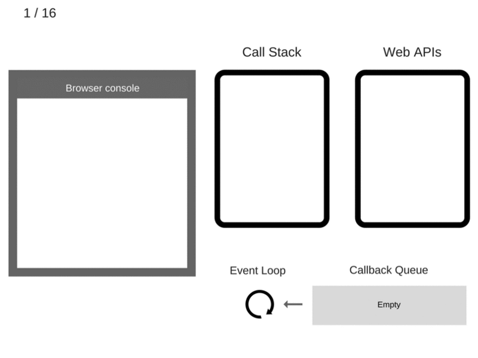

# JavaScript event loop and async

## Overview
JavaScript执行线程本身是单线程的，之所以能产生 `async` 效果，是因为它所运行的 `environment` 提供了不同的 `apis` 来帮助 `async` 的实现。如 `Browser Web API` 和 `Node C++ API`



## Concept

- `Macrotask/Task` 指的是 `Task Queue` 中的单元，每个 `Task` 结束后会清空所有的 `Microtask` 理论上队列中的任务应按次序执行，且在每个 `Macrotask` 执行间隙浏览器会执行 `render` 操作

  ```js
  // 注：测试后发现在不同的环境下表现的情况不尽相同，比如在不同浏览器环境下，以及浏览器和node环境下
  setImmediate(function(){
    console.log(1);
  },0);
  setTimeout(function(){
    console.log(2);
  },0);
  // chrome -> 1,2
  // node -> 2,1
  ```

  常见的 Macrotask：`setImmediate`、`setTimeout`、`setInterval`、`requestAnimationFrame`、`UI渲染`、`I/O`、`click`、`<script/>`

- `Microtask Queue` 可以理解为优先级更高的任务队列，引入这个概念的原因可以以  `MutationObserver` 来举例：当我们在监控DOM节点的变化时，有一个回调函数能够做一些相应的处理，同时能立即反馈在页面上，出于这样的需求，对于这样的不需要延迟的操作所以 `Microtask` 更合适，还有诸如 `Promise` 有时候会在回调中处理一些如 `render` 操作这种优先级较高的操作，延迟执行反而会引起性能问题

  `Microtask` 调用在 `Call Stack` 为空时执行一个微任务检查点，一般存在于两种情况：*1.每次回调结束且没有JavaScript在执行 2. `Macrotask` 结束*

  常见的 Microtask：`process.nextTick`、`Promise`、`Object.obserce`、`MutaionObserver`

- `Tick` 是 `Event Loop` 一次 `Iterator`

- `Job Queue` 是 `ECMAScript` 针对 `Promise` 提出来的一个概念，可以简单理解为类似 `Microtask Queue`

- `Event Loop` 本质工作是一个监控调度器，其监控范围包括 `Call Stack` 和 `Task Queue / Microtask Queue`，在监控过程中当前的**调用栈为空**（注意：此处必须是empty），就从 `Task Queue / Microtask Queue` 中取出第一个运行单元（*调用顺序：先检查 `Microtask Queue` 是否存在可调用任务，依次获取(理论上)，直到取完后，再从 `Task Queue` 中依次获取获取(理论上)*），将其推送至调用堆栈，有效运行它

```js
// pseudo code like this
// 事件轮询机制将一次iterator作为获取一次macrotask的过程
for (macroTask of macroTaskQueue) {
  // 1. 处理当前的macrotask
  handleMacroTask();
  // 2. 处理所有tick queue一般就是指process.nextTick()的情况
  for (nextTick of nextTickQueue) {
      handleNextTick(nextTick);
  }
  // 3. 处理所有microtask queue的任务
  for (microTask of microTaskQueue) {
      handleMicroTask(microTask);
  }
}
```

## Example

## Optimize
- **优先使用 `Microtask`**

  根据 `HTML Standard`，在每个 `Task` 运行完以后，`UI` 都会重渲染，那么在 `Microtask` 中就完成数据更新，当前 `Task` 结束就可以得到最新的 `UI` 了。反之如果新建一个 `Task` 来做数据更新，那么渲染就会进行两次

## Reference
- https://jakearchibald.com/2015/tasks-microtasks-queues-and-schedules/
- https://blog.sessionstack.com/how-javascript-works-event-loop-and-the-rise-of-async-programming-5-ways-to-better-coding-with-2f077c4438b5