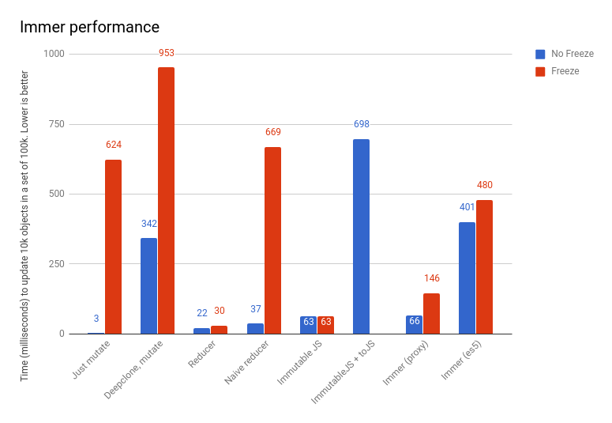

# Immer源码解析
 
在JS中无论是普通数据结构还是对象这类复杂对象，都采用 `值的引用传递` 的方式来进行赋值。这种方式能大大节省内存消耗，但是在实际开发中我们也经常因为这个特性不经意的犯一些错误，且排查困难

```js

  let objectA = { a: 'object' };
  let objectB = objectA;
  // 对objectB的操作很容易将objectA这个原始对象也牵连进去
  (function (obj) {
    obj.a = 'newObject'
    console.log(objectB)
    console.log(objectA)
  })(objectB)

```
可以看到，值引用传递的副作用问题会给大型的项目开发带来非常大的隐患，出现问题后排查也会产生很大的困扰。

因此在开发过程中我们通常会采用深浅拷贝两种方案：

`浅拷贝（shallow-copy）`：
- 只负责拷贝复杂对象的第一层，适用于类型相对简单的对象或者数组，比如 `{a: 1, b: 2}` 或者 `[1, 2, 3]`。上例中的问题靠浅拷贝能够解决

- 常见的浅拷贝方式有很多 `Object.freeze`、`Array.prototype.slice` ...，适用场景也很广泛（ `扩展运算符` 等）

- 实际项目中数据结构的复杂度远远不止于此，浅拷贝处理不了复杂对象套对象的情况

`深拷贝（deep-copy）`：
- 深拷贝可以理解为复杂对象的全量拷贝，即递归浅拷贝到对象的最内层，操作拷贝后的对象可以完全不影响原对象

- 常见的深拷贝方式一般是两种 `JSON.parse(JSON.stringify(...))` 和诸如 `lodash.deepClone` 递归浅拷贝的方式，而且序列化拷贝的方式存在很大的局限性。更多相关资料参看：[传送门][1]

- 深拷贝需要完全给新对象开辟不同的内存空间，所以数据结构越复杂，性能会越糟糕

`Immutable Data` 是一种持久化数据结构，一旦创建就不会改变，当我们生成新数据时，既要保证旧数据的可用且不变，又要避免deep-copy带来都性能损耗。所以Immutable data采用了一种 `Structural Sharing（结构共享）` 的方式来处理新生成的数据。简单来说就是，当你修改复杂对象（可以将它抽象为树结构）中的某一部分时，则遍历父级不断生成新的结构，但允许未经过任何修改的兄弟结构保持原状。


`Immutable.js` 是Facebook推出的一款市面上比较流行的不可变数据库，提供了像 `List`、 `Map` 等很多有用的数据结构和操作方法。虽然和React是同期产物，但当时确实被掩盖了锋芒。

Immutable配合React的 `shouldComponentUpdate` 能让组件避免了很多无效渲染，但是有一定的学习成本，类库也较为庞大，所以一般的项目都会慎重考虑引入。

## Immer Usage

`Immer` 是 `Mobx` 的作者的新作品，借鉴了Structural-sharing的思想，提供了一个更底层更通用的API，它本身不干涉任何数据存储，本质上它是一个 `旧数据 => 操作 => 新数据（共享结构）` 的过程，用作者自己的介绍就是 `Create the next immutable state tree by simply modifying the current tree` 不参杂新的数据结构，使得它能和所有数据框架同时使用

```js
  // redux reducer
  const reducer = function (state, action) {
    const newState = state.slice()
    switch (action.type) {
      case 'SOME_ONE':
        state.push({...state.data})
        break;
    }
    return newState
  }
  // use immer for reducer => return Structural-Sharing new Object
  const reducer = produce(draft => draft.push({...draft.data}))
  // -------------------------
  // react setState
  this.setState((preState) => {
    return {
      ...preState,
      ...someThingChange
    }
  })
  // use immer for setState
  this.setState(produce(draft => (draft.someThingChange = someThingChange)))
```

无论是配合Redux还是操作setState本身，Immer大大简化了“冗余”的浅拷贝代码，随着数据结构的复杂这一点会越发明显。开发者可以更关注数据修改本身（这实际是一种元编程的思想），且还能返回一个不是通过深拷贝得到的新对象。简直完美啊。

那Immer性能怎么样，这估计是很多使用者比较关心的，毕竟其实市面上不可变数据结构的库也不少，`总体来说还可以，支持Proxy的话，性能几乎与ImmutableJs相当，且远高于Immutable + toJs，而Immutable实际运用场景中大多需要配合toJs方法转换成普通对象`，这样看来Immer显然值得一试，至少在上手成本上几乎为零。下面是个 [基准测试][2] 比较结果：



## Immer Core API

Immer只提供了三个API，代码量也不多

- `produce(state|function, function)`：核心API，根据原始对象，经过业务操作返回新对象，支持 `Curry` 方式使用
- `setAutoFreeze`：是否设置新产生的对象是个被冻结对象（`Object.freeze / Object.isFrozen`）
- `setUseProxies`：是否使用代理对象（`Proxy.revocable`）的方式来监听处理

`produce` 接受两个两个参数，第一个参数如果是初始状态量state，第二个参数就应该是状态量的加工函数，Immer会将包装后的代理对象作为入参传入加工函数，`值得注意的是加工函数内的this也指向该代理对象`。如果第一个参数是加工函数，produce会返回一个Curry函数，`将第二个参数或者Curry函数运行时的第一个入参作为初始状态量`。

```js
  function produce(baseState, producer) {
    // produce的入参不能超过两个
    if (arguments.length !== 1 && arguments.length !== 2) throw new Error("produce expects 1 or 2 arguments, got " + arguments.length)

    // Curry方式试用produce
    if (typeof baseState === "function") {
        // 第二个参数只能接受初始状态量
        if (typeof producer === "function") throw new Error("if first argument is a function (curried invocation), the second argument to produce cannot be a function")

        const initialState = producer
        const recipe = baseState // 加工函数
        // 返回Currry包装函数
        return function() {
            const args = arguments
            // 优先取第二个参数作为初始状态量，如果为undefined，则取运行时的第一个参数作为初始状态量
            const currentState =
                args[0] === undefined && initialState !== undefined
                    ? initialState
                    : args[0]

            return produce(currentState, draft => {
                // 还是将参数原封不动传递给加工函数，只修改初始状态量为代理对象
                args[0] = draft
                // this指向代理对象
                return recipe.apply(draft, args)
            })
        }
    }

    {
      if (typeof producer !== "function") throw new Error("if first argument is not a function, the second argument to produce should be a function")
    }

    // 如果状态量是个原始对象，不需要代理直接返回
    if (typeof baseState !== "object" || baseState === null)
        return producer(baseState)
    // 状态量必须是个可代理对象，基本上也就是object或者array
    if (!isProxyable(baseState))
        throw new Error(
            `the first argument to an immer producer should be a primitive, plain object or array, got ${typeof baseState}: "${baseState}"`
        )
    // Proxy或者ES5方式注册代理
    return getUseProxies()
        ? produceProxy(baseState, producer)
        : produceEs5(baseState, producer)
  }
```

Immer核心基本上都是围绕 `Proxy` 和 `ES5` 两种代理实现方式展开的，实现思路大体一致，但有细微差别。下面我们具体来分析

`首先需要明确的是Immer中的能够被代理的，基本上也就Plain Object和Array这两种复杂类型，Map或者Set等ES6的新结构是暂时不支持的。这也是它的局限性，所以immer本身的定位就不是大而全的`
  
`common.js` 中的 `isProxy（判断一个对象是否已经被代理）` 和 `isProxyable（判断一个对象是否可以被代理）` 方法是判断代理对象和生成代理的前提

```js
  // PROXY_STATE是一个Symbol常量
  // Immer判断对象是否已经被代理过都是基于PROXY_STATE
  // 如果一个对象已经被代理，都会拦截value或value[PROXY_STATE]的getter函数，并返回value本身
  export function isProxy(value) {
    return !!value && !!value[PROXY_STATE]
  }
  // 可以看出，现在适用的可代理对象基本只有Array和Plain Object两种
  export function isProxyable(value) {
    if (!value) return false
    if (typeof value !== "object") return false
    if (Array.isArray(value)) return true
    const proto = Object.getPrototypeOf(value)
    return proto === null || proto === Object.prototype
  }
```

Immer给每个被代理对象额外记录了一些信息，不仅可以作为特定的标识位，也能够提升运行效率，每个包装后的对象都会被完整记录在全局，在方法运行结束后，恢复代理前的状态

```js
  // proxy.js
  {
    modified: false, // 对象是否被修改，体现在setter函数上
    finalized: false, // 是否已经完成修改，如果为true确定已经有copy对象了
    parent, // 对象上层
    base, // 基础对象，不动
    copy: undefined, // 原对象的copy对象（属性有可能部分是代理对象，部分为原对象）
    proxies: {} // 记录子属性的代理
  }
  // es5.js
  {
    modified: false,
    hasCopy: false, // 已经被copy的标识位
    parent,
    base,
    proxy, // 代理对象，es5没有Proxy对象，只能靠对所有属性进行监听实现
    copy: undefined,
    finished: false, // 完成所有过程不能再操作setter和getter
    finalizing: false, // 不允许在最后的检查中再创建代理
    finalized: false
  }
  // revoke or set finished of after produce
  produceEs5(baseState, producer) {
    const prevStates = states // 记录运行前的所有代理对象
    states = []
    try {
        // TODO...
        let result
        if (returnValue !== undefined && returnValue !== rootProxy) {
            // 规定：如果修改了对象，但是返回的有不是根代理对象，则抛出错误
            if (rootProxy[PROXY_STATE].modified)
                throw new Error(RETURNED_AND_MODIFIED_ERROR)
            result = finalize(returnValue)
        } else result = finalize(rootProxy)
        // Proxy.revoke释放代理对象或者finshed = true
        each(states, (_, state) => {
            state.finished = true
        })
        // 返回一个共享结构的全新对象
        return result
    } finally {
        // 全局状态恢复到运行前
        states = prevStates
    }
  }
```
由于ES5的方式不支持 `Proxy对象`，所以只能依靠监听所有的属性的 `setter/getter` 方法来实现

```js
  // proxy.js
  const objectTraps = {
    // set、get、defineProperty等handler
    // ......
  }

  const arrayTraps = {}
  each(objectTraps, (key, fn) => {
    arrayTraps[key] = function() {
      // 将state作为proxy handler的第一个参数（target）保证后续操作的统一
      arguments[0] = arguments[0][0]
      return fn.apply(this, arguments)
    }
  })
  function createProxy(parentState, base) {
    // 初始化额外的信息
    const state = createState(parentState, base)
    // 注意：Proxy的方式监听的是整个包装后的对象
    const proxy = Array.isArray(base)
        ? Proxy.revocable([state], arrayTraps)
        : Proxy.revocable(state, objectTraps)
    proxies.push(proxy)
    return proxy.proxy
  }
  // es5.js
  // 因为不支持整个对象的监听，所以只能靠监听所有属性来
  function createProxy(parent, base) {
    const proxy = shallowCopy(base)
    // 将浅拷贝后的对象作为代理对象，监听所有属性
    each(base, i => {
      Object.defineProperty(proxy, "" + i, createPropertyProxy("" + i))
    })
    // 初始化额外的信息
    const state = createState(parent, proxy, base)
    createHiddenProperty(proxy, PROXY_STATE, state)
    states.push(state)
    return proxy
  }

  function createPropertyProxy(prop) {
    return (
      // descriptors是个全局变量
      descriptors[prop] ||
      (descriptors[prop] = {
        configurable: true,
        enumerable: true,
        get() {
          return get(this[PROXY_STATE], prop) // this[PROXY_STATE] = state
        },
        set(value) {
          set(this[PROXY_STATE], prop, value)
        }
      })
    )
  }
  // Symbol值PROXY_STATE用来访问state
  function createHiddenProperty(target, prop, value) {
    Object.defineProperty(target, prop, {
      value: value,
      enumerable: false,
      writable: true
    })
  }
```

无论是Proxy还是ES5的实现方式，`加工函数能访问的都只是代理对象，所有的修改都不会流入原始对象，且代理对象都是按需生成的，用户访问到哪个位置，代理注册到哪个位置`。举个例子，`state: { a: { b: c: 'old' }}` 为原始对象，下面对它做出修改

```js
  produce(state, (draft) => {
    // draft是个代理对象，所有修改都不会流入原始对象
    draft.a.b.c = 'new'
  })
```

最初情况下，`draft` 只是对 `state` 处理的代理，当访问到 `draft.a` 时生成 `draft.a` 的代理，访问到 `draft.a.b` 的时候生成 `draft.a.b` 的代理，依次类推，这是因为 `draft只能监听到draft.a，但是无法监听到draft.a.b`，所以需要依靠懒代理的方式是个最好的方案，既能保证监听，又可以避免生成多余的代理

```js
  // proxy.js
  function get(state, prop) {
    // Symbol.for(PROXY_STATE)是一个标识位，表明是个代理对象，返回代理对象本身
    if (prop === PROXY_STATE) return state
    // modified -> 代理对象是否被修改
    if (state.modified) {
        const value = state.copy[prop]
        // only create proxy if it is not yet a proxy, and not a new object
        // (new objects don't need proxying, they will be processed in finalize anyway)
        // example:
        //        a
        //     b     c
        //  d     e    f
        // a.c.f = ... 
        // console.log(a.b)
        // a.c.f赋值后，a,c,f的modified都为true，但访问a.b时state.copy['b'] === state.base['b']
        if (value === state.base[prop] && isProxyable(value))
            return (state.copy[prop] = createProxy(state, value))
        return value
    } else {
        // 已经注册过代理的直接返回代理对象
        if (has(state.proxies, prop)) return state.proxies[prop]
        const value = state.base[prop]
        // 注册属性的代理到proxies中 -> draft.a.b的过程
        if (!isProxy(value) && isProxyable(value))
            return (state.proxies[prop] = createProxy(state, value))
        return value
    }
  }
  // es5.js
  function get(state, prop) {
    assertUnfinished(state)
    // 获得value从base或者copy
    const value = source(state)[prop]
    if (!state.finalizing && value === state.base[prop] && isProxyable(value)) {
      // only create a proxy if the value is proxyable, and the value was in the base state
      // if it wasn't in the base state, the object is already modified and we will process it in finalize
      // 不同于proxy的是在创建代理前，state.copy已经生成，同时属性的代理对象也会覆盖掉copy的同名属性
      prepareCopy(state)
      return (state.copy[prop] = createProxy(state, value))
    }
    return value
  }
  function prepareCopy(state) {
    if (state.hasCopy) return
    state.hasCopy = true
    state.copy = shallowCopy(state.base)
  }
```

属性访问的懒代理已经建立，后续要考虑的就是属性的修改，为了让produce返回的始终是新对象，且共享不可变部分的结构，参看上图。`我们需要标记修改部分的代理对象以及其父级，便于在最后的finalize处理`

```js
  // proxy.js
  function set(state, prop, value) {
    if (!state.modified) {
      // 没有做任何更改 -> draft.a = draft.a
      if (
        (prop in state.base && is(state.base[prop], value)) ||
        (has(state.proxies, prop) && state.proxies[prop] === value)
      )
        return true
      markChanged(state)
    }
    state.copy[prop] = value
    return true
  }
  function markChanged(state) {
    if (!state.modified) {
      state.modified = true
      state.copy = shallowCopy(state.base)
      // 将已经创建代理的属性替换掉copy中的同名属性
      Object.assign(state.copy, state.proxies)
      // 递归浅拷贝 + 修改modified
      if (state.parent) markChanged(state.parent)
    }
  }
  // es5.js
  function set(state, prop, value) {
    assertUnfinished(state)
    if (!state.modified) {
      // 值未改变
      if (is(source(state)[prop], value)) return
      markChanged(state)
      prepareCopy(state)
    }
    state.copy[prop] = value
  }

  function markChanged(state) {
    if (!state.modified) {
      // 与proxy不同的是这里只负责递归修改modified，浅拷贝的过程已经在创建代理前做过了
      state.modified = true
      if (state.parent) markChanged(state.parent)
    }
  }

  function prepareCopy(state) {
    if (state.hasCopy) return
    // 标记为已拷贝
    state.hasCopy = true
    state.copy = shallowCopy(state.base)
  }
```

理论上，递归向上遍历的方式能够保证只要叶子节点修改被标记，父级节点就一定会被标记。但是需要特别注意的是ES5的实现方式借助的是所有属性 `setter/getter` 方法的监听，`如果一个属性在创建代理时未被监听就很容易产生漏网之鱼，比如Object.defineProperty或者Array.prototype.push等方式来创建一个额外的属性`，都有可能不被及时捕获，这就会导致 `modified` 的不准确性。所以作者在加工函数执行完成后依靠全局states重新做了检查

```js
  function markChanges() {
    for (let i = states.length - 1; i >= 0; i--) {
      const state = states[i]
      if (state.modified === false) {
        if (Array.isArray(state.base)) {
          if (hasArrayChanges(state)) markChanged(state)
        } else if (hasObjectChanges(state)) markChanged(state)
      }
    }
  }
  function hasObjectChanges(state) {
    // 通过keys保证state.proxy没有通过非常规方式设值
    const baseKeys = Object.keys(state.base)
    const keys = Object.keys(state.proxy)
    return !shallowEqual(baseKeys, keys)
  }
  function hasArrayChanges(state) {
    const {proxy} = state
    if (proxy.length !== state.base.length) return true
    // issue #116
    const descriptor = Object.getOwnPropertyDescriptor(proxy, proxy.length - 1)
    // 这里用了很巧妙的方式，如果有新加的数组元素的get方式没有被监听，就说明这个元素没有被代理，是通过非常规方式添加的
    if (descriptor && !descriptor.get) return true
    // 其他的都是通过setter方式添加的
    return false
  }
```

`modified` 标记了状态量中哪些对象是被修改的，最后我们需要从rootProxy遍历做最后的拼合操作（修改的返回新对象，没有修改的返回base）。`Immer会从rootProxy开始检查，首先判断对象是否被代理（isProxy），如果对象被代理，检查它的modified属性是否被修改，被修改的继续比较state.copy[prop] === state.base[prop]，不全等的继续上述流程，未被修改的直接返回state.base，证明未被修改。如果对象未被代理，就继续按上述流程遍历它的子集`。

```js
  // 启动检查：根代理对象作为base进入finalize
  function finalize(base) {
    // 依据PROXY_STATE
    if (isProxy(base)) {
        const state = base[PROXY_STATE] // 取整个包装对象
        if (state.modified === true) { // 检查是否被修改
            // finalized保证相同的state不进两次
            if (state.finalized === true) return state.copy
            state.finalized = true
            return finalizeObject(
                // 注意：ES5的方式state.copy和state.proxy有可能是不同步的，state.proxy才始终代表代理对象的最新值，所以需要一次浅拷贝
                useProxies ? state.copy : (state.copy = shallowCopy(base)),
                state
            )
        } else {
            // 没修改的直接返回原对象
            return state.base
        }
    }
    finalizeNonProxiedObject(base)
    return base
  }

  function finalizeObject(copy, state) {
    const base = state.base
    each(copy, (prop, value) => {
        // 如果不想等，继续比较copy下的每一个属性
        if (value !== base[prop]) copy[prop] = finalize(value)
    })
    return freeze(copy)
  }
  // parent没有被代理的情况
  function finalizeNonProxiedObject(parent) {
    // 普通数据结构直接返回
    if (!isProxyable(parent)) return
    if (Object.isFrozen(parent)) return
    each(parent, (i, child) => {
        // 如果child有被代理的情况，继续finalize的流程
        if (isProxy(child)) {
            parent[i] = finalize(child)
        } else finalizeNonProxiedObject(child)
    })
    freeze(parent)
  }
```

`finalize` 方法除了拼接返回一个新对象外，还可以做一些额外的操作，比如我们可以设置 `setAutoFreeze(true)`，这样所有新产生的对象都会经过 `Object.freeze`，无法再做进一步修改。

## Summary

Immer是更底层的Mobx，但是它不局限于Mobx，在React中我们可以将数据挂载到容器组件，所有的视图组件继承 `PureComponent`，修改的数据因为都会经过 `produce` 的处理，所以始终返回共享结构对象。不仅在写法上得到了大大简化，还可以利用 `PureComponent shallowEqual` 带来的遍历，大大减少无效渲染。

还有一个典型的运用场景是配合 `Redux Reducer` 减少reducer中的冗余代码，社区已经有了不错的方案 [redux-box][3]，有兴趣的小伙伴可以尝试下，但是个人感觉侵入性太强，如果只是显式的将produce用在reducer中，其实也是不错的选择。

[1]:https://dassur.ma/things/deep-copy/#performance-extravaganza
[2]:https://github.com/mweststrate/immer/blob/master/__performance_tests__/todo.js
[3]:https://github.com/anish000kumar/redux-box/blob/master/readme.md
