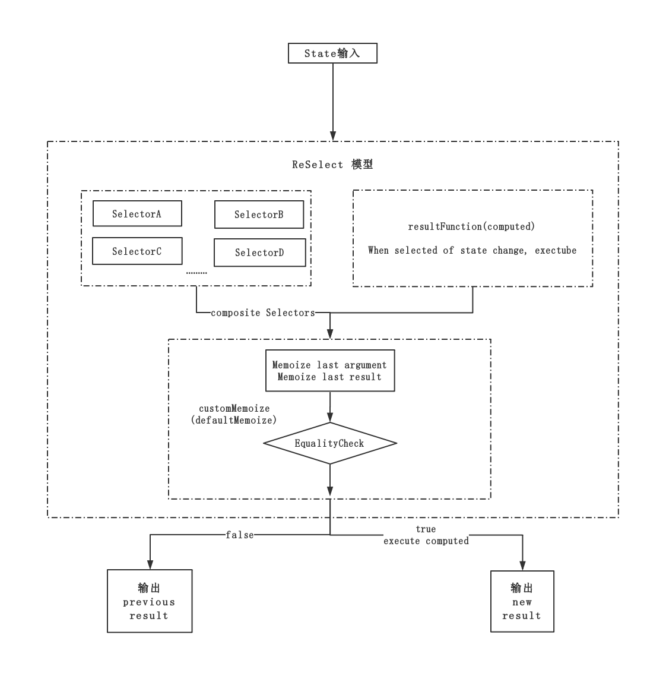

Overview
========

这篇文章主要源于一道面试题，也借机打击下我膨胀的自信心。在阿里面试的时候被问到了对于像 `Mobx computed` 这样的[衍生值][1]，在 Redux 中是如何实现的。

> Computed values are values that can be derived from the existing state or other computed values

在 Mobx 中 `computed` 通常是指基于现有的状态量来计算出衍生数据，且这个过程是联动。Mobx 是如何合理运用 computed 的问题不在本文讨论范畴，但是可以看出在复杂场景下，computed 这个概念还是非常有用的。比如：在一个基于现有数据的统计页面中，我并不需要关心某些具体的数据，我只需要统计的结果.

从逻辑的角度上 `归纳出具体的计算方程式 -> 代入参数 -> 得出结果 -> 注入视图` 是我希望看到的结果，视图只依赖于结果，结果不变，视图自然不需要重新渲染。

庞大的 Redux 社区，对于这个问题，自然是有抽象的解决方案的。这也是面试官想要考察我的，只是当时我并没有回答上来，也借此博客记录下自己事后学习 [reSelect][2] 的心得。

What is reSelect
================

**首先强调一点：不依靠 `reSelect` 我们同样能够实现数据衍生的逻辑，但同时我们要实现在数据未变更的情况下，返回原来的结果，这样才能更大力度的发挥出 `react-redux` 的作用**

那既然社区已经有 10K+ 的轮子了，何必自己撸呢，哈哈哈！

> Simple “selector” library for Redux (and others)

reSelect 作为数据的选择框架，主要被运用于 Redux 中，当然它可以不局限于在 Redux 中使用，如果你了解它内部的机制，你也可以直接运用到你的代码中，只是 react-redux 的性质，正好与它内部的 `defaultMemoize` 机制配合融洽，所以才让使用者得心应手。

> - Selectors can compute derived data, allowing Redux to store the minimal possible state.
> - Selectors are efficient. A selector is not recomputed unless one of its arguments changes.
> - Selectors are composable. They can be used as input to other selectors.

- reSelect 主要用于生成 derived data，而且 reSelect 推崇数据粒度尽可能小的连接视图，这与 react-redux 的思想也可以说是不谋而合。

- reSelect 内部用局部变量(`lastArgs`)来维系上一次的输入，在两次输入比较过程中若发现数据未发生变更，就直接返回上一次的结果(`lastResult`)，且不触发衍生函数，配合 react-redux 自然也就不会导致视图的渲染

- 最后，reSelect 是可组合的，也就是说，我们的选取函数可以是普通的 `state => state.a`，也可以是已经组合生成后的 `selector`，使用起来更加的灵活，不得不说，reSelect 让我有种相见恨晚的感觉！

How to Use it
=============

reSelect 的使用也非常的简单，基于大多数 Redux 的推崇者在开发 React 时都会延用 Redux 全家桶(redux、react-redux...)，所以下面的例子和涉及到 react-redux 的一些概念

这里有一个 reSelect 官网放出的例子，我压缩了下，先来看看使用前后的对比！

```js
  // before reSelect
  const getVisibleTodos = (todos, filter) => {
    // 对于不同的 filter type 选取不同的 todos
    // 注意：这里的返回永远是新数组
    switch (filter) {
      case 'SHOW_ALL':
        return todos
      case 'SHOW_COMPLETED':
        return todos.filter(t => t.completed)
      case 'SHOW_ACTIVE':
        return todos.filter(t => !t.completed)
    }
  }

  const mapStateToProps = (state) => {
    return {
      todos: getVisibleTodos(state.todos, state.visibilityFilter)
    }
  }
  // connect 是 react-redux 用来连接视图用的
  const VisibleTodoList = connect(
    mapStateToProps
  )(TodoList)

  export default VisibleTodoList

  // after reSelect
  const getVisibilityFilter = (state) => state.visibilityFilter
  const getTodos = (state) => state.todos
  // createSelector会返回一个函数
  // 接收的入参会传入每一个 selectors
  const getVisibleTodos = createSelector(
    // 将 selectors 作为入参
    // 也可以写作：
    // getVisibilityFilter -> arguments[0]
    // getTodos -> arguments[1]
    [ getVisibilityFilter, getTodos ],
    (visibilityFilter, todos) => {
      switch (visibilityFilter) {
        case 'SHOW_ALL':
          return todos
        case 'SHOW_COMPLETED':
          return todos.filter(t => t.completed)
        case 'SHOW_ACTIVE':
          return todos.filter(t => !t.completed)
      }
    }
  )

  const mapStateToProps = (state) => {
    return {
      // 实际场景中我们还会将其他的参数传入 selectors -> 比如：props
      // getVisibleTodos(state, props)
      todos: getVisibleTodos(state)
    }
  }

  const VisibleTodoList = connect(
    mapStateToProps
  )(TodoList)

  export default VisibleTodoList
```

这就是一个通用的 reSelect 的用法，可以看出代码量上其实相差无几，但是 reSelect 内部已经做了一些优化

值得注意的是：在未使用 reSelect 时，我们的选择函数每次都会返回一个新的对象，大多数时候这也是产生 React 无效渲染的根本原因，待会我们可以来看看 reSelect 内部怎么解决，这也是本文讨论的核心

reSelect 为了让 reSelect 高度可扩展，依靠 `策略模式` 提供了一些内部API供开发者做定制化的需求

  - `defaultMemoize`：reSelect 内部的 `记忆函数`，暴露出来主要是为了适应一些只需要变更 `equalityCheck(比较方式)` 的定制需求，一般会配合 `createSelectorCreator` 一起使用，下面会讲例子

  - `createSelectorCreator`：生成Selector 的创建函数，接受 `customMemoize` 和 `memoizeOptions(一起传入customMemoize中)` 返回一个 Selector

```js
  // 定制一个 Selector
  const customSelectorCreator = createSelectorCreator(
    // 自定义一个记忆函数也可以仍旧使用 defaultMemoize
    customMemoize,
    // 下面的所有参数都会被送入customMemoize中
    // 但是注意：
    // 如果 customMemoize = defaultMemoize
    // option1 只能是前后参数的比较函数，这是defaultMemoize实现性质决定的
    option1,
    option2,
    option3
  )

  const customSelector = customSelectorCreator(
    input1,
    input2,
    // 衍生函数(计算值)
    resultFunc
  )
  // 第一个参数是衍生函数
  // 后面的参数都是createSelectorCreator送进来的
  customMemoize(resultFunc, option1, option2, option3)
```

此外，reSelect 还可以为不同的 selector 选取的值指定特定的 key 值，组装出特定的数据结构，这对于需要层次化的 react-Props 结构非常有用，能应用于我们大多数组件的props结构，算是 reSelect 为我们提供的一个小工具吧

```js
  const mySelectorA = state => state.a
  const mySelectorB = state => state.b

  const structuredSelector = createStructuredSelector({
    x: mySelectorA,
    y: mySelectorB
  })
  // state -> { a: 1, b: 2 }
  structuredSelector({ a: 1, b: 2 })
  // =======>
  // 返回 { x: 1, y: 2 }

  // ------------ 分割线 -------------

  // createStructuredSelector 是可组合的
  const nestedSelector = createStructuredSelector({
    x: createStructuredSelector({
      a: state => state.a,
      b: state => state.b
    }),
    y: createStructuredSelector({
      c: state => state.c,
      d: state => state.d
    })
  })
  // if state => { a: 1, b: 2, c: 3, d: 4 }
  nestedSelector({ a: 1, b: 2, c: 3, d: 4 })
  // 输出 => { x: { a: 1, b: 2 }, y: { c: 3, d: 4 } }
```

Principle for reSelect
======================

reSelect API 部分不多，已经讲完了，鉴于 reSelect 源码也不过 100+ 行，所以我们就直接来解析下源码，看看它是怎么实现的

```js
  // createSelector
  export const createSelector = createSelectorCreator(defaultMemoize)
```

`createSelector` 函数出奇的简单，看来核心代码在 `createSelectorCreator` 中，从中我们也可以看到 **`createSelector` 只是 `createSelectorCreator` 运用 `defaultMemoize` 这种策略下的结果**

```js
  // 为了方便理解，这里先起个Demo，后面的解析依据这个Demo，请自行对应：
  const state = { a: 1, b: 2 }
  const selectorA = state => state.a
  const selectorB = state => state.b
  const selector = createSelector(
    selectorA,
    selectorB,
    (a, b) => {

    } // resultFunc
  )
  selector(state)
  // --------------- 分割线 -----------------
  // getDependencies
  function getDependencies(funcs) {
    // 支持两种写法：
    // createSelector(selectorA, selectorB, resultFunc)
    // createSelector([selectorA selectorB], resultFunc)
    const dependencies = Array.isArray(funcs[0]) ? funcs[0] : funcs
    // 所有selector都必须是函数
    if (!dependencies.every(dep => typeof dep === 'function')) {
      const dependencyTypes = dependencies.map(
        dep => typeof dep
      ).join(', ')
      throw new Error(
        'Selector creators expect all input-selectors to be functions, ' +
        `instead received the following types: [${dependencyTypes}]`
      )
    }

    return dependencies
  }
  // createSelectorCreator
  export function createSelectorCreator(memoize, ...memoizeOptions) {
    // createSelector(selectorA, selectorB, resultFunc)
    return (...funcs) => {
      // recomputations 用来记录 resultFunc 被调用了几次
      let recomputations = 0
      // resultFunc 是衍生函数
      const resultFunc = funcs.pop()
      // 检查所有selectors都必须是函数
      const dependencies = getDependencies(funcs)

      const memoizedResultFunc = memoize(
        // 为了记录recomputations， 包装了一层
        function () {
          recomputations++
          // 这里的 arguments 是指 a, b，既所有selectors的返回结果
          return resultFunc.apply(null, arguments)
        },
        ...memoizeOptions
      )

      // 这里之所以需要使用defaultMemoize，是为了当selector的入参相同时，不再触发selectors
      // 即：前后触发的state全等，就不触发selectors
      const selector = defaultMemoize(function () {
        const params = []
        const length = dependencies.length

        for (let i = 0; i < length; i++) {
          // 运行所有的selectors，并收集所有结果，后期统一注入到resultFunc中
          // 这里的 arguments 是指 state
          params.push(dependencies[i].apply(null, arguments))
        }

        // params 发生变更才会触发 resultFunc
        return memoizedResultFunc.apply(null, params)
      })
      // 给selectors增加些相关接口，不是研究重点
      selector.resultFunc = resultFunc
      selector.recomputations = () => recomputations
      selector.resetRecomputations = () => recomputations = 0
      return selector
    }
  }
```

其实从 selector 的实现就可以看出，返回的 selector 其实和 selectorA、selectorB 并没有实质区别，都是 `入参 -> 依据规则 -> 返回规则`，只不过这里 `它的入参是：selectorA、selectorB 的结果，规则是：resultFunc衍生函数`

所以关键部分在于 `memoize` 如何处理比较和记忆的过程！下面我们来看代码

```js
  // 默认使用全等比较
  function defaultEqualityCheck(a, b) {
    return a === b
  }
  // prev 和 next 做 every 比较，只有全相等时才为true
  function areArgumentsShallowlyEqual(equalityCheck, prev, next) {
    if (prev === null || next === null || prev.length !== next.length) {
      return false
    }

    const length = prev.length
    for (let i = 0; i < length; i++) {
      // defaultEqualityCheck | customEqualityCheck
      if (!equalityCheck(prev[i], next[i])) {
        return false
      }
    }

    return true
  }
  // 这是createSelector默认使用的记忆函数，当然你可以自己替换它的，注：selector(state) 入口的 defaultMemoize 不能替换
  // equalityCheck 是比较规则，也可以自己定义的。注：createSelectorCreator的第二个参数可以指定
  export function defaultMemoize(func, equalityCheck = defaultEqualityCheck) {
    // 用了两个自由变量来记忆数据，空间换时间的过程
    let lastArgs = null // 存上一次的入参
    let lastResult = null // 存储输出结果
    // 返回一个闭包
    return function () {
      // 根据比较规则比较前后入参 -> 记忆函数的关键
      if (!areArgumentsShallowlyEqual(equalityCheck, lastArgs, arguments)) {
        // 存储结果
        lastResult = func.apply(null, arguments)
      }
      // 记录入参，用于下一次areArgumentsShallowlyEqual比较
      lastArgs = arguments
      // 比较结果：true -> 返回运行结果，false -> 返回上一次运行结果
      return lastResult
    }
  }
```

reSelect 的核心代码其实就是 `defaultMemoize`，围绕两个自由变量，reSelect 记录下了参数和结果，根据特定的 `EqualityCheck` 的比较结果确定是否执行衍生函数。当然，你也可以自己写出定制化的 `Memoize` 函数，这都取决于你自己！

最后再简单的看下 `createStructuredSelector`：

```js
  export function createStructuredSelector(selectors, selectorCreator = createSelector) {
    // selectors 必须是个对象
    if (typeof selectors !== 'object') {
      throw new Error(
        'createStructuredSelector expects first argument to be an object ' +
        `where each property is a selector, instead received a ${typeof selectors}`
      )
    }
    const objectKeys = Object.keys(selectors)
    // 默认：createSelector，也可以自己指定
    return selectorCreator(
      // 对照前面的例子可以看出 这里返回所有 selectors
      objectKeys.map(key => selectors[key]),
      // values 是 selectors的返回结果
      (...values) => {
        return values.reduce((composition, value, index) => {
          // 按位置(index)将 key 和 value 相对应（结合之前的例子看这里会更清晰）
          composition[objectKeys[index]] = value
          return composition
        }, {})
      }
    )
  }
```

综上：作者觉得 reSelect 的实现的功能未必很难，但是可以借鉴的是它实现思想，既提供了内置的记忆模式，又将控制权限暴露出来，供使用者扩展。

最后附上一张自己总结的 reSelect 流程图！



reSelect 的出现是 Redux 推广应运而生的结果，但是借助 flows 可以看出它并不局限于 Redux，理论上你可以将它运用于任何需要 `联动可观察节点，生成衍生数据` 的地方。

Why is reSelect
===============

从衍生值的层面来看，reSelect 让我们避免一些冗余的状态存储在 Store 中

  ```js
    class Component extends React.Component {
      render() {
        const { a, b, f(a, b) } = this.props
        return (
          <div>
            <span>{a}</span>
            <span>{b}</span>
            <span>{f(a, b)}</span>
          </div>
        )
      }
    }
    // 不依赖于衍生值的话，只能将f(a, b)放入 store中
    const store = {
      a,
      b,
      computed: f(a, b)
    }
  ```

这样处理的方式不仅增加了store的复杂度，增加了大量的冗余数据，同时 Reducer 也会变的不可维护。a 和 b 的变更都需要手动去计算 f(a, b) 这样的做法不仅不直观，而且会变得非常复杂。

当然，你也可以把 f(a, b) 的过程提取到组件内部去做，但这样违背了 `保持组件逻辑简单` 的原则，理论上 `a,b -> f(a, b)` 的过程对用户来说，最好是不需要手动处理的，reSelect 的存在也正是为了解决这个痛点。

<!-- some link -->
[1]:https://mobx.js.org/refguide/computed-decorator.html
[2]:https://github.com/reduxjs/reselect/blob/master/README.md